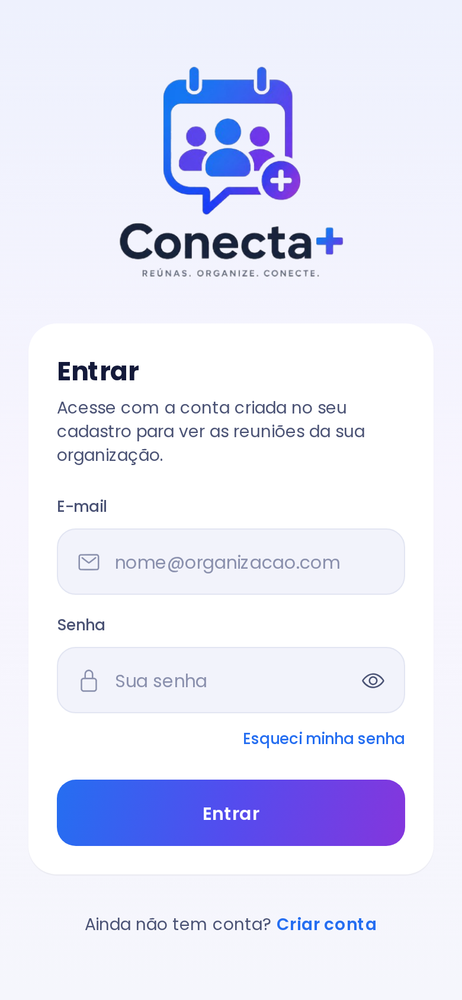
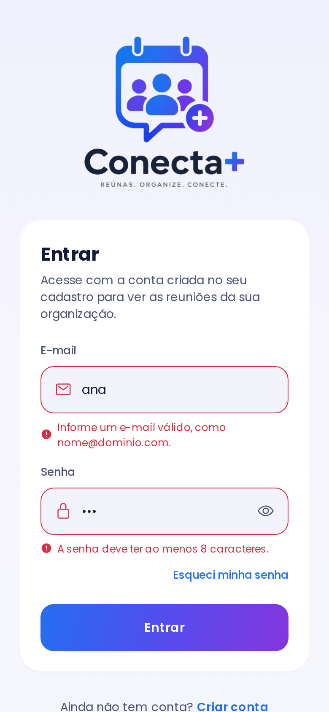
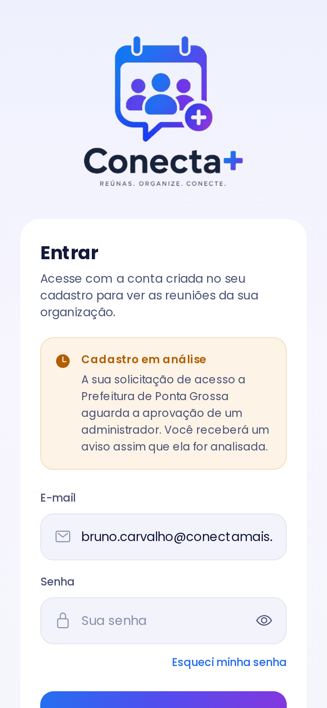

# Conecta+

Aplicativo mobile para gerenciamento do ciclo de uma reunião — calendário,
participantes, pauta, anotações, tarefas e histórico em um só lugar.

A proposta completa do projeto está em [`PropostaInicial/objetivos.md`](PropostaInicial/objetivos.md).

## Situação atual

**Incremento 1 — Cadastro de usuário: tela de login implementada.**

A tela de login autentica o usuário e mostra em que situação está a sua
solicitação de acesso à organização, ligando o login ao fluxo de cadastro:

| Situação do usuário | O que a tela faz |
| --- | --- |
| Cadastro aprovado | Encaminha para a tela inicial |
| Aguardando aprovação | Informa que a solicitação está em análise pelo administrador |
| Solicitação recusada | Informa a recusa e orienta o usuário |
| Sem organização vinculada | Orienta a solicitar acesso a uma organização |

A documentação do requisito, os casos de teste e as evidências estão em
[`docs/incremento-1/RF-login.md`](docs/incremento-1/RF-login.md).

<p align="center">
  
  
  
</p>

As telas de cadastro de usuário e de recuperação de conta ainda não foram
implementadas: existem como destino de navegação, identificadas na própria tela.

## Tecnologias

Conforme definido na proposta inicial:

- **React Native** com **Expo** (SDK 57) — Android e iOS
- **Expo Router** — navegação entre telas
- **NativeWind** — estilos por classes, mantendo o padrão visual
- **TypeScript**

## Como executar

```bash
npm install
npm start
```

Depois, leia o QR Code com o aplicativo **Expo Go** ou use `npm run android` /
`npm run ios`.

### Servidor

O aplicativo usa exclusivamente a API NestJS. Defina a variável de ambiente e
reinicie o Expo:

```bash
EXPO_PUBLIC_API_URL=http://192.168.0.10:3000 npm start
```

O aplicativo chama `POST /auth/login`. Se a variável não estiver definida, o
login falhará informando que não foi possível conectar ao servidor.

## Estrutura

```
src/
├── app/                     rotas (Expo Router)
│   ├── (auth)/
│   │   ├── login.tsx        tela de login
│   │   ├── cadastro.tsx     cadastro de usuário (próximo requisito)
│   │   └── recuperar-conta.tsx  recuperação de conta (próximo requisito)
│   └── inicio.tsx           destino do login aprovado
├── components/              componentes reutilizáveis das telas
├── constants/theme.ts       cores e tipografia da identidade visual
├── hooks/useLogin.ts        estado e regras da tela de login
├── models/usuario.ts        modelo de usuário e situações de acesso
├── services/                autenticação e comunicação com a API
└── utils/validacao.ts       validações de formulário
```

## Identidade visual

As cores, a tipografia (Poppins) e o logotipo vêm do documento de identidade
visual do projeto (`PropostaInicial/Topico3.pdf`) e estão centralizados em
[`src/constants/theme.ts`](src/constants/theme.ts) e em `tailwind.config.js`.

| | | | | | | |
| --- | --- | --- | --- | --- | --- | --- |
| `#1e2080` | `#544cee` | `#256ef1` | `#5e46e8` | `#1a3ff9` | `#363ac5` | `#8436dd` |

## Verificação

```bash
npm run typecheck   # tsc --noEmit
npm run lint        # expo lint
```

## Convenções

Seguem o definido na proposta inicial:

| Elemento | Padrão | Exemplo |
| --- | --- | --- |
| Variáveis e funções | camelCase | `validarEmail()` |
| Componentes e telas | PascalCase | `CampoTexto`, `TelaLogin` |
| Constantes | UPPER_SNAKE_CASE | `TAMANHO_MINIMO_SENHA` |
| Rotas de API | substantivos consistentes | `/auth/login` |

As rotas do Expo Router usam nomes de arquivo em minúsculas porque o caminho do
arquivo é a própria URL da tela; o componente exportado mantém o PascalCase.
